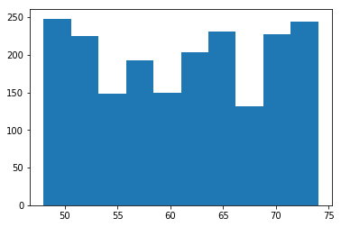
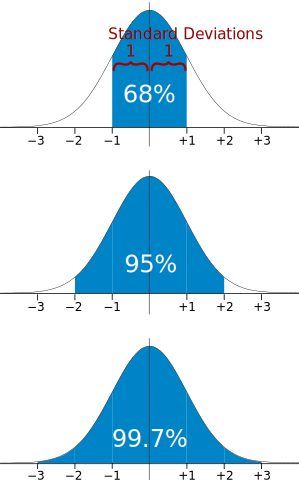

# Objectives
YWBAT
* calculate a zscore by hand
* plot a histogram, kde plot and zplot of a given dataset
* explain what a zscore represents
* explain what skewness and kurtosis meausure
* calculate skewness and kurtosis by hand and using scipy.stats


```python
import numpy as np
import pandas as pd

import matplotlib.pyplot as plt
import seaborn as sns

np.random.seed(42)
```


```python
data = np.random.randint(48, 75, 2000) # uniform distribution
noise = np.random.normal(0, 2, 2000) # adding noise to my data

plt.hist(data)
plt.show()
```





```python
noisy_data = data + noise
plt.hist(noisy_data)
plt.show()
```


```python
# zscore 
# let's say we want to compare the distribution of height vs ages

ages = np.random.normal(50, 12, 2000)
plt.hist(ages)
plt.show()
```


# zscores put everything on the same scale

# let's chat about standard deviation of a normal distribution




```python
# minz around -4 and maxz 4

# create a zscore formula and plot the zscore distributions of our data
```


```python
print(np.mean(noisy_data), np.std(noisy_data))
print(noisy_data)
print(noisy_data-np.mean(noisy_data))
print((noisy_data-np.mean(noisy_data))/np.std(noisy_data))
```

    61.06384634392797 8.185274966660591
    [64.30040236 61.80164827 65.69327399 ... 57.21505779 75.99314102
     49.06700924]
    [  3.23655601   0.73780193   4.62942765 ...  -3.84878856  14.92929468
     -11.9968371 ]
    [ 0.39541201  0.09013771  0.56557998 ... -0.47020883  1.82392097
     -1.46566085]


# what is 0.5 in terms of a zscore
* roughly half of standard deviation in the positive direction


```python
def zscores(data):
    mu = np.mean(data)
    std = np.std(data)
    data_zscores = (data - mu)/std
    return data_zscores
```


```python
noisy_data_z = zscores(noisy_data)
```


```python
plt.hist(noisy_data)
plt.show()

plt.hist(noisy_data_z)
plt.show()
```


```python
# let's compare ages and height
ages_z = zscores(ages)
```


```python
plt.hist(noisy_data_z)
plt.show()

plt.hist(ages_z)
plt.show()
```


# Why else are zscores handy?
Ztables calculate pdfs of various zscore and they're standard for all normal distributions

# Questions on zscores
* What is the mean of a z-score histogram/distribution?
    * the mean is 0
* What is the standard deviation of a z-score histogram/distribution?
    * the standard deviation is 1
* range of a zscore distribution
    * -3.5 to 3.5

# If I have a distribution of zscores
* what is the mean? 0
* what is the standard deviation? 1


```python
# let's generate a random zscore list of 100 points
random_zscores = np.random.normal(0, 1, 100)
plt.hist(random_zscores)
plt.show()
```


# skewness and kurtosis


# skewness = average cubed difference
* why cube the difference?
    * if a difference is negative, cubing the difference maintains it's negativeness
    * if a difference is positive, cubing the difference maintains it's positiveness
    * exaggerates differences, if you're close it makes the distance smaller, if you're far away it makes the distance larger
    * scores lie between -3 and 3

# kurtosis = average quartic difference
* why quartic power?
    * exaggerates differences, if you're close it makes the distance smaller, if you're far away it makes the distance larger
    * makes everything positive which makes the sum larger
    * scores lie between 0 and 3 
    


```python

```
